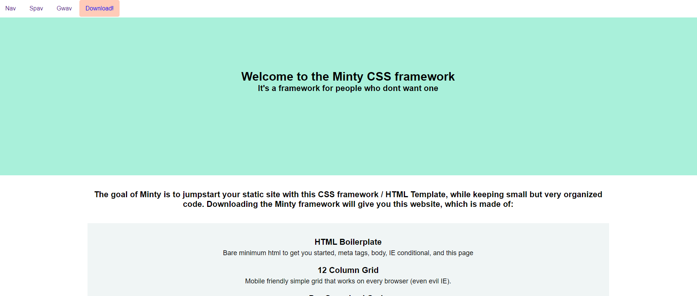

# Minty - Framework and Boilerplate 

 

I decided to create a CSS framework and clean HTML boilerplate to streamline my static website process. As a front end designer who enjoys custom styling, I am adverse to bloaed frameworks and Libraries. Here I created my own , I call it Minty. Included is a templte website, CSS grid using a Bootstrap style 12 column grid and similar naming convention, and a pre-written table of contents and notes throughout the files so you can write hundreds of lines of code, and hopefully not create a monster.
* [Live! Minty](https://stephenamaya.github.io/lesters-garden-bistro/)

### Installing

You could clone this repo and use the files as you wish, or I included a download link on the github pages website so you can get started with the zip file.

Either way, open the index.html file and get er started. 

## Inspiration

* [Simple Grid](https://simplegrid.io/) 
* [Min CSS](https://mincss.com/ 
* [Bootstrap](https://getbootstrap.com/) 

## License

This project is licensed under the MIT License - see the [LICENSE.md](LICENSE.md) file for details
